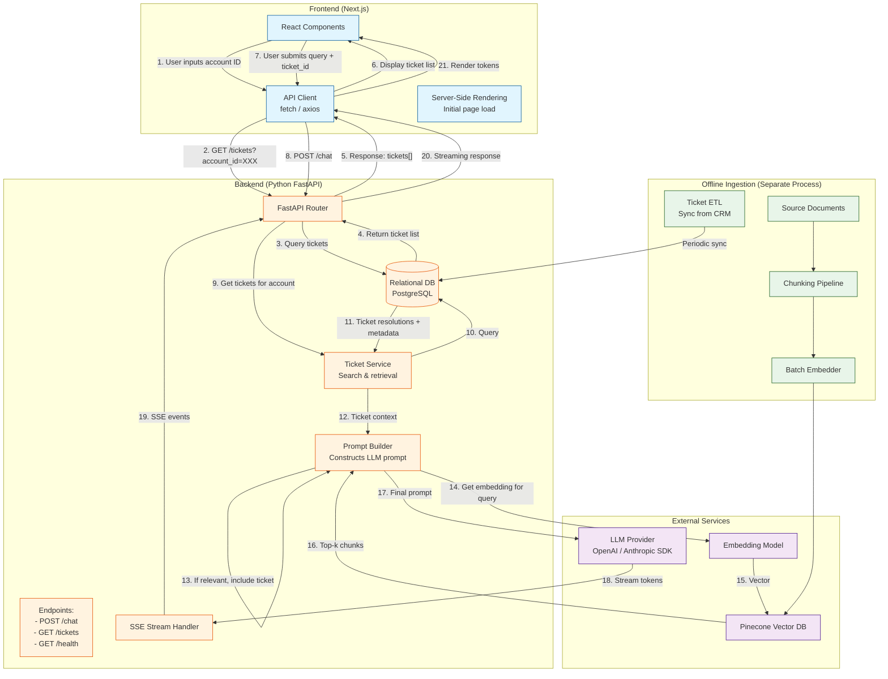

# AI Agent - Azure ASR Migrate AI Agent - Technical Documentation


## 1. Data Model
### 1.1 Vector Database
- Vector Database Decision: Pinecone
- Functionality: Use Pinecone Vector DB to store internal documentation.

#### 1.1.1 Vector DB Metadata
- file_name
- path
- chunk_index
- content
- original_row_index

### 1.2 Relational Database
- Relational Database: PostgreSQL
- Functionality: Use PostgreSQL to store User data, historical tickets number.

#### 1.2.1 Users Table (users)
- account_id: Primary key
- email: Email (unique)
- name: Display name
- created_at: Creation timestamp
- historical_tickets: Historical tickets numbers (list)

#### 1.2.2 Ticket Table (tickets)
- ticket_number: Primary key
- account_id: User Account number
- subject: Ticket name
- status: Ticket status
- created_at: Creation timestamp
- resolution: Solution provided previously about this ticket

Relationship: One user can have many tickets(one-to-many)


## 2. API Design
- `GET /tickets`
  - Query params: `account_id` (required)
  - Response:
    ```
    {"tickets": [{"ticket_number": 1, "account_id": "1234567","issue": "Payment issue", "status": "closed", "created_at": "2026-03-19","resolution": "..."}]}
    ```

- `GET /health`
  - Response:
    ```
    {"status": "ok", "timestamp": "..."}
    ```

- `POST /chat`
  - Body: 
    ```
    {"account_id": "1234567", "query": "How do I enable replication for VMware VMs?"}
    ```
  - Response:
    `text/event-stream (SSE)` with `data: token` chunks, ends with `data: [DONE]`


## 3. Architecture Diagram
Here we design a RAG system for retrieving internal documents as referenced context.

### 3.1 Data Flow Explanation
#### 3.1.1 Online Query Path (real-time)
1. **Load Tickets for Account** - The Next.js server renders the initial page with a form asking for Account ID. User enters Account ID and clicks "Load Tickets". The database returns the tickets list.
2. **Send Question** - User type a question; Next.js frontend sends `POST /chat` to FastAPI backend with JSON body.
3. **Search Past Tickets (relational DB)** - Backend queries the relational DB for tickets belonging to this account that are relevant to the query:
    - Exact match search: ticket `subject` or `resolution` contains keywords from the query;
Database returns matching tickets information.
4. **Retrieve Relevant Documents from Pinecone** - Backend calls the embedding models to convert the user's question into an embedding vector. The vector is sent to Pinecone with a metadata filter (e.g., accountID) to retrieve only relevant document chunks. Pinecone returns the most similar chunks (with metadata: source, chunk text, score).
5. **Build Prompt and call LLM** - Backend constructs a prompt containing:
   - System instructions
   - Retrieved chunks (from Pinecone)
   - The past ticket resolution (if found)
   - User question
  Then it calls the LLM SDK (e.g., `openai.chat.completions.create`).
6. **Stream the Response back to the Frontend** - LLM starts generating tokens and returns them as a stream. Backend streams the tokens as SSE events back to Next.js frontend over the same HTTP connection. Next.js receives the `done` event, stops the streaming and displays the source references.
7. **Completion** - User sees the complete answer with source listed.

#### 3.1.2 Offline Ingestion Path (asynchronous)
##### 3.1.2.1 Document Ingestion
1. **Source Documents** - New documents (PDF, Word, etc.) are uploaded via internal admin UI or automated pipeline.
2. **Chunking** - Documents are split into overlapping chunks (e.g., 500 tokens, overlap 50).
3. **Embedding** - Each chunk is passed to the same embedding model to generate a vector.
4. **Upsert to Pinecone** - Vectors are inserted into Pinecone DB along with metadata (accountId, username, source, chunk index, score, etc.).

##### 3.1.2.2 Ticket Sync (ETL)
1. **A scheduled job (cron) runs** (e.g., every hour) to pull new/updated tickets from the CRM or ticketing system.
2. **The job inserts/updates ticket records** in the relational database (PostgreSQL) with fields: `ticket_number`, `account_id`, `subject`, `status`, `resolution`, `created_at`.
3. **The main API queries this table** during online requests.


### 3.2 Architecture Diagram


### 3.3 User Flowchart Diagram

```mermaid
sequenceDiagram
    participant User
    participant NextJS as Next.js Frontend
    participant FastAPI as FastAPI Backend
    participant RDB as Relational DB<br/>(PostgreSQL)
    participant Pinecone as Pinecone Vector DB
    participant LLM as LLM SDK

    %% Step 1: Get tickets for account
    User->>NextJS: Enters Account ID
    NextJS->>FastAPI: GET /tickets?account_id=123
    FastAPI->>RDB: SELECT * FROM tickets WHERE account_id=123
    RDB-->>FastAPI: Ticket list with IDs, names, status
    FastAPI-->>NextJS: 200 OK + tickets[]
    NextJS-->>User: Display ticket list (dropdown/checkboxes)

    %% Step 2: User asks question
    User->>NextJS: Selects ticket OR types new question
    Note over User,NextJS: User may reference a specific ticket

    User->>NextJS: Submits question
    NextJS->>FastAPI: POST /chat<br/>{account_id, query, ticket_id?}
    
    FastAPI->>RDB: Query past tickets for this account
    RDB-->>FastAPI: Matching tickets (if any)
    
    alt Relevant tickets found
        FastAPI->>FastAPI: Build prompt with ticket context
    else No relevant tickets
        FastAPI->>FastAPI: Build prompt without ticket context
    end

    FastAPI->>Pinecone: Query vector DB for chunks
    Note over FastAPI,Pinecone: Filter by account_id if needed
    Pinecone-->>FastAPI: Top-k chunks

    FastAPI->>FastAPI: Construct final prompt<br/>(system + tickets + chunks + query)
    FastAPI->>LLM: Call with stream=True
    loop Token streaming
        LLM-->>FastAPI: Token chunk
        FastAPI-->>NextJS: SSE data: token
        NextJS-->>User: Append token to UI
    end
    FastAPI-->>NextJS: SSE event: done + sources
    NextJS-->>User: Show complete answer + references

    %% Health check
    Note over FastAPI: GET /health returns {"status":"ok"}
```



## 4. Third-Party Integrations
### 4.1 OpenAI API
- Purpose: AI conversation features
- Environment variable: OPENAI_API_KEY, OPENAI_BASE_URL
- Limitation: 60 requests per minute


## 5. Technical Decisions
### 5.1 Stack
- **Frontend**: Next.js (client-side, calls backend)
- **Backend**: FastAPI (API route) + Python (Business Logic)
- **Vector DB**: Pinecone
- **Relational DB**: PostgreSQL (store user data and tickets data)

### 5.2 Database Hosting
- **Relational DB**: PostgreSQL (AI has deep understanding, generating accurate data model code)
