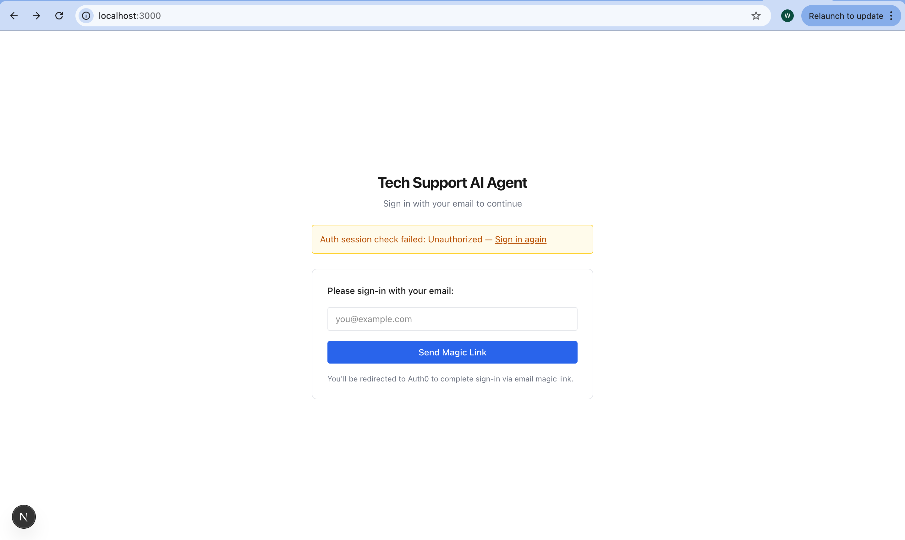
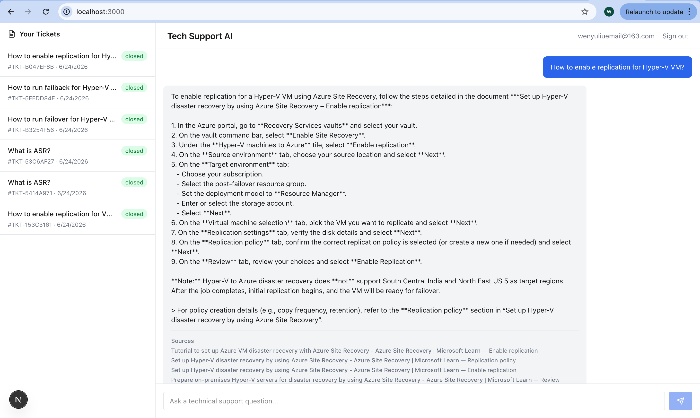

# Tech Support AI Agent

A RAG-powered technical support assistant that answers questions using curated Knowledge Base documents and account-scoped ticket history. Built with FastAPI, Next.js 16, Pinecone, PostgreSQL, and OpenAI-compatible LLMs.

## Overview

End users ask technical support questions through a web chat interface. The system retrieves relevant content from two sources — a Pinecone-backed Knowledge Base of product documentation and PostgreSQL-stored historical support tickets — then streams grounded, citation-backed answers via SSE. Every answer cites its sources. When the Knowledge Base lacks sufficient information, the system refuses to fabricate an answer rather than guessing.

### How it works

1. User authenticates via Auth0 email magic link, receives a JWT containing their `account_id`
2. Frontend loads the user's historical tickets (`GET /tickets`) scoped to that account
3. User submits a question; the backend generates a query embedding and retrieves:
   - **Knowledge Base chunks** from Pinecone via semantic vector search
   - **Ticket context** from PostgreSQL filtered by `account_id`
4. A prompt is built from the system instructions, retrieved chunks, ticket history, and user query
5. The LLM streams tokens back to the frontend as SSE events, interleaved with citation and ticket-context metadata
6. On completion, the conversation is persisted as a new ticket for future reference

### Key design decisions

| Decision | Rationale |
|---|---|
| KB is global, tickets are account-scoped | KB guidance is canonical; tickets personalize without becoming the source of truth ([ADR-01](docs/adr/01-retrieval-isolation-model.md)) |
| Hybrid retrieval (vector + relational) | Semantic search for KB relevance + exact match for ticket history ([ADR-02](docs/adr/02-hybrid-retrieval-strategy.md)) |
| Deterministic ingestion with versioned chunk IDs | Safe re-indexing without silent drift ([ADR-03](docs/adr/03-knowledge-base-ingestion-versioning.md)) |
| Three-layer backend (routers → services → repositories) | Isolates HTTP concerns, business logic, and external system access for testability |
| Ticket context is secondary, never overrides KB | Prevents outdated ticket resolutions from contradicting current documentation |

### Live Agent Overview

The following is the Live Tech Support Agent screen capture.
<p align="center">
  
</p>

<p align="center">
  
</p>


## Tech Stack

| Layer | Technology |
|---|---|
| Frontend | Next.js 16 (App Router), React, TypeScript, Tailwind CSS v4 |
| Backend | FastAPI, Pydantic v2, Python 3.12 |
| Auth | Auth0 (email magic link / passwordless) |
| Vector DB | Pinecone |
| Relational DB | PostgreSQL (asyncpg + SQLAlchemy) |
| LLM | OpenAI-compatible (DeepSeek, Zhipu, or any provider) |
| Embeddings | Zhipu embedding-3 (1024-d) |
| Task runner | pnpm |

## Project Structure

```
.
├── docs/
│   ├── knowledge_base/        # 14 Azure Site Recovery & DR tutorials (.md)
│   ├── eval/                  # Evaluation dataset & thresholds (YAML)
│   └── adr/                   # Architecture Decision Records
├── src/
│   ├── app/                   # FastAPI backend
│   │   ├── routers/           # HTTP/SSE route handlers (/chat, /tickets, /health)
│   │   ├── services/          # Business logic (chat orchestration, auth, ingestion)
│   │   ├── repositories/      # External system access (Pinecone, OpenAI, PostgreSQL)
│   │   ├── ingestion/         # Offline KB ingestion CLI
│   │   ├── tests/             # pytest test suite (unit, integration, structural, eval)
│   │   ├── config.py          # Pydantic settings (env-driven)
│   │   └── main.py            # FastAPI app entry point
│   └── web/                   # Next.js frontend
│       ├── app/
│       │   ├── components/    # ChatPanel, TicketPanel
│       │   └── page.tsx       # Main chat + ticket UI
│       └── lib/               # API client, Auth0 configuration, SSE proxy
├── .env.example               # Environment variable template
├── package.json               # pnpm workspace root + scripts
├── AGENTS.md                  # Coding agent control surface
├── ARCHITECTURE.md            # Full technical architecture doc
├── CONTEXT.md                 # Domain language glossary
├── CONVENTIONS.md             # Coding standards and layer rules
└── REVIEW-STANDARDS.md        # Code review criteria
```

## Prerequisites

- **Node.js** ≥ 20, **pnpm** ≥ 9
- **Python** 3.12 with venv at `src/app/.venv`
- **PostgreSQL** instance (local or remote)
- **Pinecone** index (or local emulator on port 5080)
- **Auth0** tenant with a passwordless email connection
- **LLM API key** (DeepSeek, OpenAI, or OpenAI-compatible)
- **Embedding API key** (Zhipu or OpenAI-compatible)

## Setup

1. Clone and install dependencies
```bash
# 1. Clone and install dependencies
git clone <repo-url>
cd tech-support-ai-agent
pnpm install
cd src/app && python3 -m venv .venv && source .venv/bin/activate && pip install -r requirements.txt
```

2. Configure environment
```bash
cp .env.example .env
# Edit .env with your API keys, database URL, and Auth0 credentials
```

3. Set up the database
```bash
# Create PostgreSQL database and run schema (see ARCHITECTURE.md §1.2)
cd infra/
docker compose up -d
```

4. Ingest the Knowledge Base
```bash
pnpm ingest
```

5. Start development
```bash
pnpm dev          # starts both frontend (:3000) and backend (:8000)
```

## Scripts

| Command | Description |
|---|---|
| `pnpm dev` | Start frontend + backend concurrently |
| `pnpm dev:web` | Next.js dev server only (`:3000`) |
| `pnpm dev:api` | FastAPI dev server only (`:8000`) |
| `pnpm build` | Production build (frontend) |
| `pnpm lint` | Frontend lint (eslint) |
| `pnpm lint:api` | Backend lint (ruff) |
| `pnpm test:api` | Run all backend tests (18 tests) |
| `pnpm test:eval` | Run RAG evaluation tests (7 tests) |
| `pnpm check:structure` | Structural boundary tests |
| `pnpm ingest` | Run KB ingestion pipeline |
| `pnpm typecheck:api` | mypy strict type checking |

## API Endpoints

| Method | Path | Auth | Description |
|---|---|---|---|
| `GET` | `/health` | None | Health check with timestamp |
| `GET` | `/tickets` | Bearer token | Account-scoped ticket list |
| `POST` | `/chat` | Bearer token | Streaming chat with SSE response |

### `POST /chat` SSE Events

| Event type | Description |
|---|---|
| `citation` | Knowledge Base chunk used to ground the answer |
| `ticket_context` | Historical ticket referenced (secondary context only) |
| `token` | Streaming token from the LLM |
| `error` | LLM or provider failure with trace ID |
| `done` | Terminal event — stream complete |

## Testing

The test suite covers all three backend layers plus structural invariants:

```
tests/
├── test_routers.py      # HTTP handler tests with mocked services
├── test_services.py     # Chat + Ingestion service unit tests
├── test_structure.py    # Layer boundary, file size, account-scoping checks
└── test_eval.py         # RAG quality evaluation (parametrized from YAML)
```

**Structural tests** enforce:
- No backward imports across layers (routers → services → repositories)
- Python files ≤ 300 lines
- Every ticket query filters by `account_id`

## Evaluation

Evaluation cases are defined in [docs/eval/eval_set.yaml](docs/eval/eval_set.yaml). Each case specifies a query, expected KB documents, ticket context, and answer quality criteria. Tests run against the `ChatService` with mocked repositories and validate:

- **Retrieval correctness** — citations present when KB content matches
- **Grounding** — answers cite sources; fallback answers refuse to fabricate
- **Conflict handling** — KB guidance always wins over ticket history
- **Hallucination guardrails** — forbidden phrases absent from output

Quality thresholds are defined in [docs/eval/thresholds.yaml](docs/eval/thresholds.yaml) and serve as CI release gates.

## Documentation

- **[ARCHITECTURE.md](ARCHITECTURE.md)** — Full system design: data model, API contracts, retrieval flow, ingestion pipeline, failure modes, security controls
- **[CONTEXT.md](CONTEXT.md)** — Domain glossary with canonical terms and anti-patterns
- **[CONVENTIONS.md](CONVENTIONS.md)** — Coding standards, layer rules, RAG patterns
- **[REVIEW-STANDARDS.md](REVIEW-STANDARDS.md)** — Code review criteria and done definitions
- **[AGENTS.md](AGENTS.md)** — Agent definitions and collaboration rules (for AI-assisted development)
- **[docs/adr/](docs/adr/)** — Architecture Decision Records

## Environment Variables

See [.env.example](.env.example) for the full template. Key variables:

| Variable | Purpose |
|---|---|
| `CHAT_API_KEY` / `CHAT_BASE_URL` / `CHAT_MODEL` | LLM provider configuration |
| `EMBEDDING_API_KEY` / `EMBEDDING_BASE_URL` / `EMBEDDING_MODEL` | Embedding model |
| `PINECONE_API_KEY` / `PINECONE_HOST_URL` / `PINECONE_INDEX_NAME` | Pinecone connection |
| `DATABASE_URL` | PostgreSQL async connection string |
| `IDP_DOMAIN` / `IDP_CLIENT_ID` / `IDP_CLIENT_SECRET` / `IDP_AUDIENCE` | Auth0 configuration |
| `NEXT_PUBLIC_AUTH0_*` | Frontend Auth0 client settings |
| `AUTH0_SECRET` | Next.js Auth0 session encryption key |
| `CORS_ORIGIN` | Allowed frontend origin |
